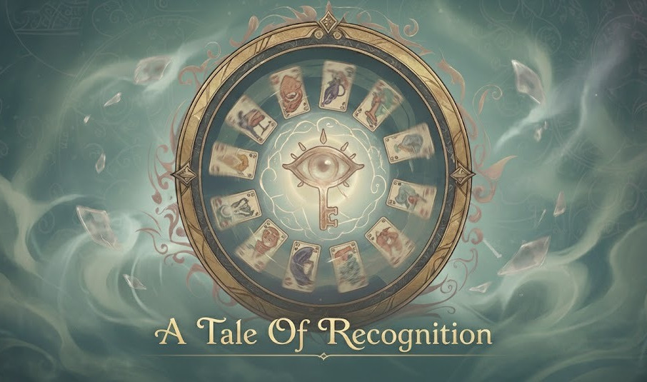

# Tale of Recognition - KeyStudios

	
	
	
	

## Misión

 crea experiencias de juego digitales innovadoras, accesibles y colaborativas, uniendo diseño, tecnología y trabajo en equipo para ofrecer una plataforma sólida e intuitiva en tiempo real.

	

## ✨ Overview

A Tale of Recognition es una plataforma software inspirada en Dixit y Dixit Stella que digitaliza la experiencia de juego y la adapta a partidas en línea con soporte web y móvil.

## 🔎 What it includes

- Partidas en tiempo real con soporte web y móvil.
- Backend modular con API REST y comunicación por sockets.
- Infraestructura separada para despliegue y orquestación.
- Cliente móvil desarrollado con Expo.
- Utilidad específica para probar sockets con tokens.

## 👥 Equipo de Desarrollo

### Frontend (Web)
- **Eduardo Sánchez** - [@EduSS282](https://github.com/EduSS282)
- **Samuel Gallego** - [@SamuGallego](https://github.com/SamuGallego)

### Mobile
- **Sergio Guerra** - [@868307](https://github.com/868307)
- **Mohamed Rayen** - [@RayanUnizar](https://github.com/RayanUnizar)

### Backend
- **Violeta Veras** - [@FSPPX](https://github.com/FSPPX)
- **Athanasios Usero** - [@Azzal-e](https://github.com/Azzal-e)
- **Hugo López Navarro** - [@hachelpez13](https://github.com/hachelpez13)
- **Elías Zabaleta** - [@EliZaba-dev](https://github.com/EliZaba-dev)

## 🏗️ Repositories

| Repository | Purpose |
| --- | --- |
| `infraestructura-proyecto` | Orquestación y despliegue con Docker Compose para backend y frontend web. |
| `Backend` | API y lógica del servidor. |
| `Frontend` | Frontend web. |
| `Movil` | Aplicación móvil. |
| `socket-tester` | Utilidad para probar sockets del backend con tokens. |
| `.github` | Documentación y configuración compartida de la organización. |

## 🛠️ Tech Stack

### Frontend

	
	

### Mobile

	
	
	

### Backend

	
	
	
	
	
	

### Infraestructura

	
	

## 🧩 Architecture at a glance

- Frontend web en Angular consumiendo API REST y WebSockets.
- Backend en Node.js con Express y Socket.io.
- Persistencia en PostgreSQL.
- Estado en tiempo real y caching con Redis.
- Despliegue y entorno local gestionados desde `infraestructura-proyecto`.

## 🚀 Instalación y Configuración

La instalación y el arranque del entorno se gestionan desde el repositorio `infraestructura-proyecto`, donde está documentado el flujo completo de despliegue local y las variables necesarias. Consulta el README de ese repositorio para levantar la infraestructura común del proyecto.

## 📦 Quick links

- [Repositorio de infraestructura](https://github.com/Unizar-30226-2026-11/infraestructura-proyecto)
- [Frontend web](https://github.com/Unizar-30226-2026-11/Frontend)
- [Backend](https://github.com/Unizar-30226-2026-11/Backend)
- [Móvil](https://github.com/Unizar-30226-2026-11/Movil)
- [Utilidad de sockets](https://github.com/Unizar-30226-2026-11/socket-tester)

## 📝 Convenciones de Desarrollo

### Git Workflow
- `main`: rama principal de producción
- `develop`: rama de desarrollo
- `feature/*`: ramas para nuevas funcionalidades
- `bugfix/*`: ramas para corrección de errores

### Commits
Seguir el formato: `tipo(alcance): descripción`
- `feat`: nueva funcionalidad
- `fix`: corrección de error
- `docs`: documentación
- `style`: formato, espacios en blanco
- `refactor`: refactorización de código
- `test`: añadir o modificar tests
- `chore`: tareas de mantenimiento

## 📚 Documentación

La documentación específica de cada parte del sistema se mantiene en el README de cada repositorio y en la sección Wiki de la organización cuando procede.

## 🤝 Cómo Contribuir

1. Hacer un fork del repositorio correspondiente.
2. Crear una rama de trabajo a partir de `develop` o de la rama indicada en ese repositorio.
3. Realizar los cambios y comprobar que encajan con las convenciones del proyecto.
4. Abrir un Pull Request hacia el repositorio original.
5. Esperar revisión del equipo responsable.
